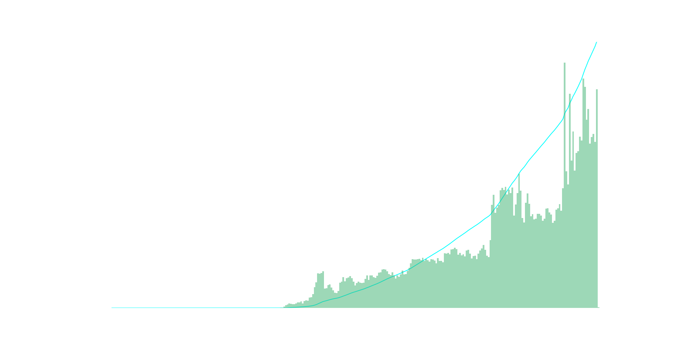
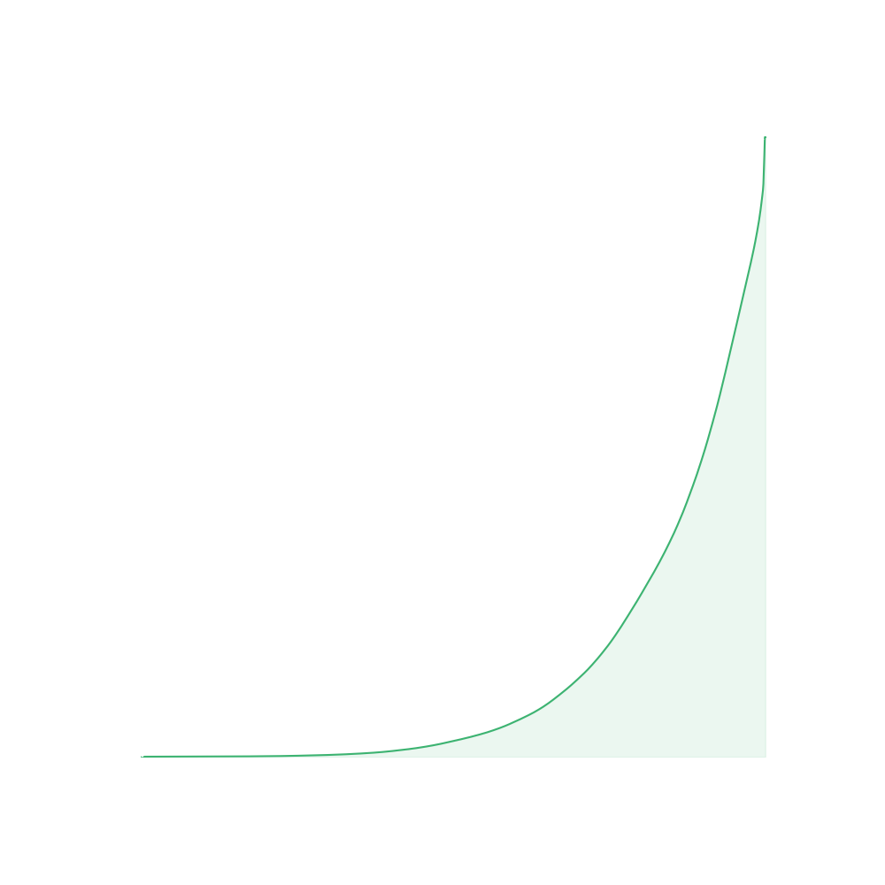

# April Fool's Tokenomics

## Key findings and insights

- The token has been minted 576,167 times, resulted in a total supply of 576,167,000
- A total of 1,291 addresses participate in the minting event
- Top 127 addresses hold 50% of the supply - 9.84% of 1,291 participants
- 74,215,000 token has been minted from the smart contract
- Upon conclusion of the minting event, the Gini coefficient is 72.4%
- The minting event peak at ~3,000 mint per minute

## Temporal Distribution of Minting Activity

The data shows that minting activity started relatively modestly, with fewer tokens being minted in the initial hours. As time progressed, there was a marked increase in both the frequency and volume of minting transactions. This suggests a growing awareness or interest in the minting event, potentially influenced by social network effects or word-of-mouth dissemination. The peak is at more than 10,000 mint within 5 minutes interval. 

## Slicing the Birthday Cake: Celebration of 'Proof of Finger'

The Lorenz curve for Shitzu's token distribution post-minting paints a vivid picture of reward through engagement. Embracing the playful 'Proof of Finger' meme, the curve reflects a community-driven ethos where the most dedicated participants—the fervent clickers—are rewarded. The swift uptick at the curve's end signifies that those who believed in Shitzu's vision and acted upon it by frequently engaging with the minting process have amassed a greater share of the tokens.

This distribution model champions activity and commitment, aligning with the optimistic spirit of Shitzu's April Fool's launch. The Gini coefficient, standing at 0.7245, is not just a number—it's a testament to the enthusiasm of the community. It highlights a system where effort equates to earning, and the zeal to click that mint button more than others has shaped the new tokenomics landscape. Far from the solemnity of traditional financial systems, Shitzu's token distribution is a celebration of participation, reward, and the joyous 'Proof of Finger' principle.

