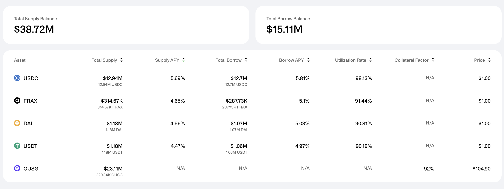

# Ondo x Flux Finance

Ondo Finance and Flux Finance collaborate to create a unique lending and borrowing ecosystem that integrates tokenized assets. Ondo Finance plays a pivotal role in this ecosystem by issuing a tokenized U.S. Treasury bond, denoted as $OUSG, exclusively to accredited investors. This tokenization facilitates the use of $OUSG as collateral within Flux Finance's lending protocol, allowing holders to borrow USDC against their $OUSG holdings.

This integration yields two significant effects:

1. **Leveraging Treasury Yields:** $OUSG holders have the opportunity to leverage the yields of the U.S. Treasury bonds. By collateralizing their $OUSG holdings, they can borrow USDC, which can then be used to purchase additional $OUSG. This process can be repeated, allowing holders to amplify their exposure to treasury yields.
2. **Earning Yield from USDC Deposits:** The ecosystem also benefits users who deposit USDC. These depositors can earn a yield that approximates 80% of the $OUSG yield. This yield is sourced from the interest paid by those who leverage their $OUSG holdings. Essentially bringing part of the U.S. Treasury bonds to anyone on-chain.

Let's explore it from an on-chain evidence